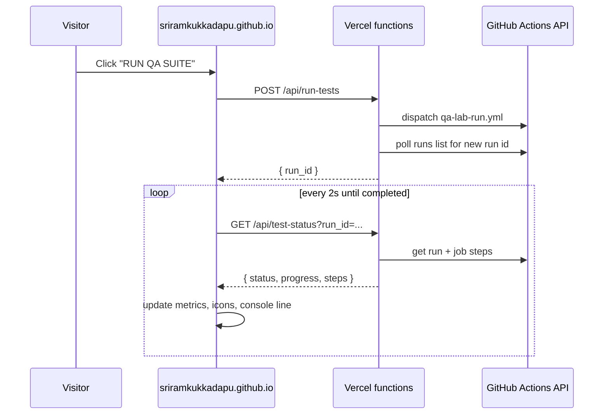

# Architecture & Build Log

How this portfolio was built, in the order it actually happened — tech
choices, the GitHub/Vercel setup, and how the "RUN QA SUITE" button
really works. Written as a reference for future changes, not a tutorial.

## 1. Starting point

The brief: build a portfolio similar in spirit to
[alicepaggi.github.io/portfolio](https://alicepaggi.github.io/portfolio/),
personalized with Sriram's own resume content, hosted for free.

Before writing any code, the reference site's actual source was pulled
down and inspected directly (not guessed from screenshots):

```bash
curl -s https://alicepaggi.github.io/portfolio/ -o ref.html
curl -s https://alicepaggi.github.io/portfolio/css/style.css -o ref-style.css
curl -s https://alicepaggi.github.io/portfolio/css/accessibility.css -o ref-accessibility.css
curl -s https://alicepaggi.github.io/portfolio/js/main.js -o ref-main.js
```

That gave the real section structure, class names, CSS custom
properties, fonts (DM Sans + Space Grotesk), and the QA Lab
console/metrics markup to mirror — plus confirmation (via the linked
GitHub repo's file listing) that the site is plain HTML/CSS/JS, no
framework, deployed straight to GitHub Pages.

## 2. Tech stack decisions

- **Plain HTML/CSS/JS** — no build step, easiest to hand-edit content,
  matches the reference exactly.
- **Playwright** for the site's own e2e suite (`e2e/portfolio.spec.js`) —
  the obvious choice given this is a QA/automation portfolio, and it's
  what the reference site itself does ("this portfolio tests itself").
- **GitHub Pages** for hosting, **GitHub Actions** for CI/CD — free,
  and keeps everything in one repo.
- **Vercel** for one small piece only (see §6) — a serverless backend
  for the live test-trigger button, since GitHub Pages can't run
  server code.

## 3. Repo and Pages setup

Local tooling had no `gh` CLI, no Homebrew, and no GitHub credentials
configured, so that was set up first:

1. Downloaded the `gh` CLI release binary directly (no Homebrew needed)
   and ran `gh auth login --hostname github.com --git-protocol ssh --web`
   — a device-code flow (`https://github.com/login/device` + one-time
   code) the user completed in their browser.
2. `gh auth setup-git` wired the token into git's credential helper for
   HTTPS pushes.
3. `gh repo create portfolio --public --source=. --remote=origin` created
   `github.com/sriramkukkadapu/portfolio` and pushed the initial commit.
4. First push failed with *"refusing to allow an OAuth App to create or
   update workflow ... without `workflow` scope"* — fixed with
   `gh auth refresh -h github.com -s workflow` (another device-code
   approval), then the push succeeded.
5. Enabled Pages via the API (Settings → Pages didn't need manual
   clicking):
   ```bash
   gh api -X POST repos/sriramkukkadapu/portfolio/pages -f build_type=workflow
   ```
   This sets Pages' source to "GitHub Actions" rather than a branch.

## 4. Content decisions

Resume content (BT, Thoughtworks, Oracle, SAP roles; skills; education;
awards) was transcribed into the site's sections, with a few deliberate
edits:

- **Left out**: phone number, date of birth, marital status, home
  address — not appropriate for a public page.
- **Public contact**: Gmail address, LinkedIn, GitHub, and blog —
  all from the resume/user, not invented.
- **"Personal Projects"** (a section in the reference site) was
  repurposed as **"Awards & Recognition"**, populated with the real
  recognitions from the resume (SAP spot awards, the Waldorf/Germany
  onsite trip, Thoughtworks recruitment recognition, department
  topper, two SAP appreciation notes) — there was no equivalent
  "personal side projects" material to put there honestly.
- **"Selected Work"** kept as three highlight cards (pricing-suite
  optimization, Gen AI test generation, Kroger monolith→microservices)
  but *without* the reference site's linked case-study sub-pages,
  since there's no case-study write-up material to build those from.
- Photo: user-supplied headshot, resized/compressed locally with
  macOS `sips` (1.2MB PNG → ~80KB JPEG) before adding to `assets/`.

## 5. Visual design

The reference site's CSS was used as a structural template — same
section layout, typography scale, card/timeline/grid patterns — but
recolored from its teal palette to an indigo/blue one, keeping the same
CSS custom-property architecture so the swap was a small, contained
diff:

```css
:root {
  --bg: #f7f7f9;       /* was a warm off-white */
  --text: #181a23;     /* was near-black green-grey */
  --accent: #5b6ee6;   /* was teal #42c7ce */
  --accent-dark: #3a48b8;
  ...
}
```

## 6. The QA Lab: from static, to honest-but-static, to genuinely live

This went through three iterations:

1. **First pass** — QA Lab metrics were populated from
   `assets/test-summary.json`, a small file regenerated by
   `scripts/generate-summary.js` from Playwright's own JSON reporter
   output after every CI run. Accurate, but the "RUN QA SUITE" button
   didn't exist yet.
2. **Second pass** — added a "RUN QA SUITE" button that linked out to
   the real GitHub Actions run history for the repo (via
   `actions/workflows/deploy.yml`, upgraded client-side to the actual
   latest run's URL using the public, unauthenticated GitHub REST API).
   Truthful, zero infrastructure, but not "live" — it didn't start
   anything.
3. **Final pass** (current) — the button genuinely dispatches a new
   GitHub Actions run and polls it in real time, matching the reference
   site's behavior. This needed a backend, because GitHub Pages only
   serves static files.

### 6.1 Why a *separate* workflow for live runs

`.github/workflows/deploy.yml` (push-triggered) runs the full suite as
one `npm test` step, then builds and deploys the site. It was **not**
reused for the live button, for two reasons:

- Its single `npm test` step can't report *per-test-group* progress —
  the GitHub Actions Jobs API only exposes status/conclusion at the
  **step** level, not per individual test.
- Piggybacking visitor-triggered runs onto the deploy workflow would
  mean every button click also re-deploys the site.

So `.github/workflows/qa-lab-run.yml` is a second, `workflow_dispatch`-only
workflow, with the suite split into five *named* steps so each one's
step-level `conclusion` in the Jobs API corresponds to one test group:

```yaml
- name: Run Smoke tests [6]
  run: npx playwright test --grep "Smoke"
- name: Run Navigation [24]
  if: ${{ !cancelled() }}
  run: npx playwright test --grep "Navigation"
# ...Content integrity [9], Contact links [3], QA Lab [12]
```

`if: ${{ !cancelled() }}` (not `continue-on-error`) is deliberate: with
`continue-on-error: true`, GitHub masks a failed step's reported
`conclusion` to `success` (that's what `steps.<id>.outcome` vs
`.conclusion` exists to work around) — which would have made failures
invisible to the polling API. Without it, a real failure genuinely
shows as `conclusion: "failure"` for that step, and later steps still
run (rather than being skipped) because of `!cancelled()`.

`concurrency: { group: qa-lab-run }` stops two dispatches from
overlapping at the GitHub Actions level, as a second line of defense
alongside the API's own "already running" check (§6.2).

The test counts in step names (`[6]`, `[24]`, …) are each Playwright
`describe` block's test count × 3 browser projects (chromium/firefox/
webkit) — e.g. "Smoke" has 2 real tests × 3 browsers = 6. These numbers
are duplicated in three places that must stay in sync: the step names
in `qa-lab-run.yml`, the `GROUPS` array in `api/test-status.js`, and the
`<small>` labels in the `.qa-test-list` markup in `index.html`.

### 6.2 The serverless backend (Vercel)

Two functions, deployed from the *same* GitHub repo as a separate
Vercel project (Vercel auto-detects the `api/` folder):

- **`api/run-tests.js`** (`POST`) — checks for an already
  queued/in-progress `qa-lab-run.yml` run first (so a second click
  joins the existing run instead of queuing a duplicate); otherwise
  calls GitHub's `workflow_dispatch` API, then polls the runs list for
  up to 8 seconds to find the new run's ID (the dispatch API itself
  doesn't return one).
- **`api/test-status.js`** (`GET ?run_id=...`) — fetches that run and
  its job's steps from the GitHub REST API, matches each step name
  against the `GROUPS` table to compute `{ passed, failed, total }`,
  and returns it alongside the run's overall `status`/`conclusion`/
  `html_url`.
- **`api/_github.js`** — shared helper (GitHub auth headers, CORS
  headers scoped to `https://sriramkukkadapu.github.io`, an
  `OPTIONS` preflight handler). Vercel ignores `_`-prefixed files as
  routes, so this is importable but not itself an endpoint.

Both need a GitHub token with permission to dispatch/read Actions runs
on this one repo, read from `process.env.GH_DISPATCH_TOKEN`. Setup, done
by the user directly (the token never passed through this session):

1. New Vercel project, imported from `sriramkukkadapu/portfolio`,
   framework preset "Other" (no build step needed).
2. A **fine-grained GitHub PAT**, scoped to only the `portfolio`
   repository, permission **Actions: Read and write** — created in
   GitHub's own UI.
3. Added as the `GH_DISPATCH_TOKEN` environment variable directly in
   Vercel's dashboard (Settings → Environments → Production), then a
   manual redeploy so the function picked it up.
4. Hit an extra snag: Vercel's **Deployment Protection** ("Vercel
   Authentication") was on by default, which 302-redirected every
   request — including plain API calls — to a Vercel SSO login page.
   Had to be explicitly disabled in Settings → Deployment Protection,
   since the whole point is that anonymous portfolio visitors can call
   these endpoints.
5. The resulting URL (`https://portfolio-sriram-self.vercel.app`) was
   set as `window.QA_LAB_API_BASE` in an inline `<script>` in
   `index.html`, right before `js/main.js` loads.

### 6.3 Client-side wiring (`js/main.js`)

An IIFE reads `window.QA_LAB_API_BASE`. If it's empty (i.e. no backend
configured), clicking the button just reports "Live triggering isn't
configured yet" — a safe default rather than a silent failure. Once
configured:

- Click → `POST {API_BASE}/api/run-tests` → get back a `run_id`.
- Poll `GET {API_BASE}/api/test-status?run_id=...` every 2s.
- Each poll updates: the three header metrics (tests passed/total,
  browsers, pass rate), the five test-group status icons (✓ / … / ×,
  matched by step name), the console-style status line, and a link to
  the live GitHub Actions run once one exists.
- Stops polling once `status === "completed"`.



### 6.4 Verifying it before shipping

Two rounds of verification, on purpose kept separate from the
committed Playwright suite (clicking the real button from *within* the
suite that the button itself triggers would risk a self-triggering
loop — the CI run's own tests would dispatch another CI run):

1. **Local mock backend** — a throwaway Node script
   (`mock-qa-lab.js`, never committed) spun up a fake `run-tests`/
   `test-status` server simulating a run progressing through all five
   groups, served a temp copy of the site with `QA_LAB_API_BASE` baked
   in, and drove it with Playwright to screenshot the "starting",
   "mid-run", and "done" states. This caught a test-harness bug (a
   `page.addInitScript` override being clobbered by the page's own
   hardcoded inline script) — not an app bug — before it could be
   mistaken for one.
2. **Real backend, real run** — once Vercel was deployed, the actual
   endpoints were hit directly with `curl`: a real `POST /api/run-tests`
   dispatched an actual `qa-lab-run.yml` run, and polling
   `GET /api/test-status` through to completion confirmed
   `54/54 passed` end-to-end before wiring the URL into the live site.

The committed e2e test for the button
(`QA Lab › run QA suite button is present and enabled`) deliberately
only checks the button exists, is enabled, and reads "RUN QA SUITE" —
it never actually clicks it, precisely to avoid that self-triggering
risk during CI runs.

## 7. Everyday maintenance

- **Content changes**: edit `index.html`/`css/style.css` directly, run
  `npm test` locally, commit and push to `main` — `deploy.yml` runs the
  suite and redeploys automatically.
- **Test-group counts changed** (added/removed a test): update the
  three places listed in §6.1 (workflow step names, `api/test-status.js`
  `GROUPS`, and the `.qa-test-list` markup) together, or the live
  progress bar will under/over-count.
- **Rotating the GitHub token**: revoke the old fine-grained PAT in
  GitHub, issue a new one (same scope: `portfolio` repo, Actions
  read/write), update `GH_DISPATCH_TOKEN` in Vercel, redeploy.
